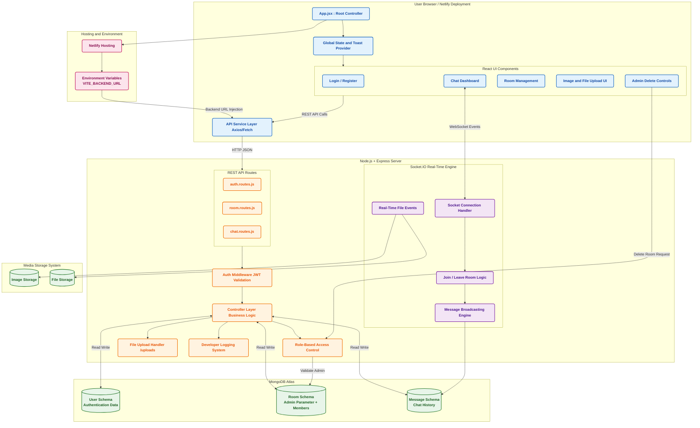
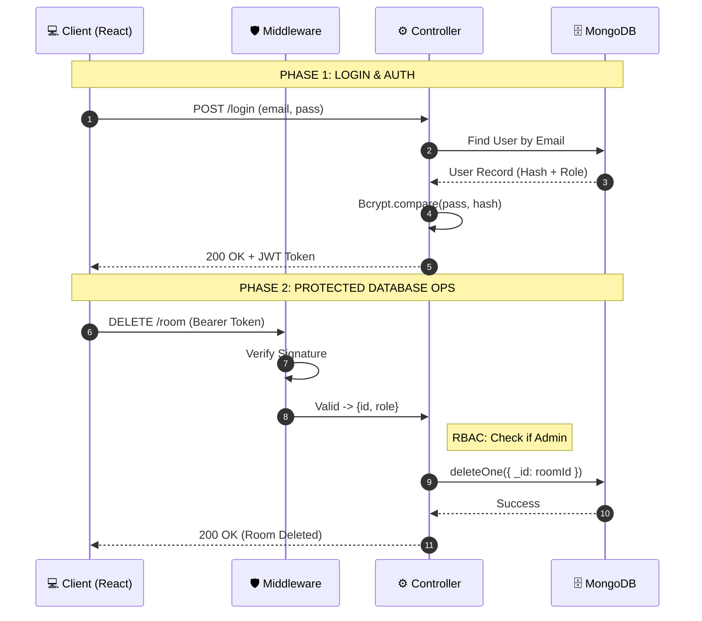
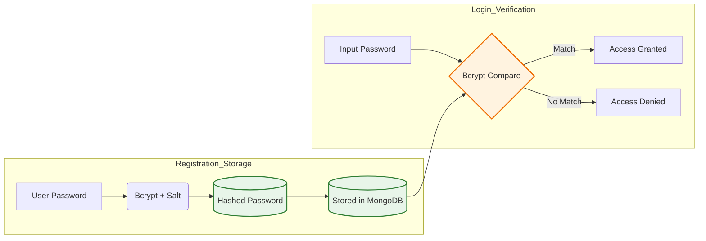

# InterviewXP: A Community-Driven Interview Experience Platform


[](https://6991c4b4646d99f0b8ab966e--interviewxp.netlify.app/)
**Developed by:** silent commit

---
<br/>

## 📖 TABLE OF CONTENTS

<table style="width: 100%; border-collapse: collapse; font-family: 'Times New Roman', Times, serif;">
  <tr style="background-color: #f8f9fa;">
    <th style="padding: 12px; border: 1px solid #ddd; text-align: left;">Section</th>
    <th style="padding: 12px; border: 1px solid #ddd; text-align: left;">Key Highlights</th>
  </tr>
  <tr>
    <td style="padding: 10px; border: 1px solid #ddd;">🚀 <b><a href="#-problem--solution">Problem & Solution</a></b></td>
    <td style="padding: 10px; border: 1px solid #ddd;">Addressing the information gap in recruitment[cite: 7, 8].</td>
  </tr>
  <tr>
    <td style="padding: 10px; border: 1px solid #ddd;">📈 <b><a href="#-project-impact">Project Impact</a></b></td>
    <td style="padding: 10px; border: 1px solid #ddd;">Analysis of 202+ Clones and system performance[cite: 303, 304].</td>
  </tr>
  <tr>
    <td style="padding: 10px; border: 1px solid #ddd;">🏗 <b><a href="#-system-architecture">System Architecture</a></b></td>
    <td style="padding: 10px; border: 1px solid #ddd;">Full-stack data flow and MERN design[cite: 21, 22].</td>
  </tr>
  <tr>
    <td style="padding: 10px; border: 1px solid #ddd;">🔐 <b><a href="#-security--authentication-jwt">Security & Auth</a></b></td>
    <td style="padding: 10px; border: 1px solid #ddd;">JWT Logic and Bcrypt password hashing[cite: 206, 207].</td>
  </tr>
  <tr>
    <td style="padding: 10px; border: 1px solid #ddd;">📂 <b><a href="#-project-structure">Project Structure</a></b></td>
    <td style="padding: 10px; border: 1px solid #ddd;">Comprehensive file and folder hierarchy[cite: 335].</td>
  </tr>
  <tr>
    <td style="padding: 10px; border: 1px solid #ddd;">🔮 <b><a href="#-future-roadmap">Future Roadmap</a></b></td>
    <td style="padding: 10px; border: 1px solid #ddd;">AI Interviewer and Microservices plans[cite: 313, 314].</td>
  </tr>
</table>

<br/>[Future Roadmap](#-future-scope--roadmap)

---

## 🚀 Problem & Solution

### The Problem: "The Information Gap in Technical Recruitment"
Computer science students and job seekers often face significant anxiety and uncertainty during the recruitment process due to a lack of transparent, accessible information. While generic interview questions are widely available, specific insights into recent interview patterns, company-specific rounds, and real-world experiences are often scattered across fragmented forums or locked behind paywalls.

### The Solution: "InterviewXP"
We developed **InterviewXP**, a full-stack web application designed to democratize access to interview knowledge.
* **Centralized Knowledge Hub:** A dedicated social platform where students and professionals can document and share detailed interview experiences.
* **Peer-to-Peer Learning:** Fosters a collaborative community where successful candidates help aspirants navigate the complexities of technical interviews.

---

## 📈 Project Impact
The project has demonstrated significant initial interest within the developer community.

* **Traffic Analysis:** The repository recorded **202 Clones** and **95 Unique Cloners** in a recent 14-day period, indicating strong utility and intent to use the codebase.
* **Real-Time Engagement:** Successfully implemented a real-time room-based communication system supporting concurrent users through WebSocket architecture.

---

## 🛠 Tech Stack

| Domain | Technologies Used |
| :--- | :--- |
| **Frontend** | React.js, Vite, Tailwind CSS, Context API |
| **Backend** | Node.js, Express.js (RESTful API) |
| **Database** | MongoDB (Atlas), Mongoose Schemas |
| **Real-Time** | Socket.io (WebSockets) |
| **Security** | JWT (JSON Web Tokens), Bcrypt |
| **Deployment** | Netlify (Frontend), Render (Backend) |

---

## 🏗 System Architecture

The application follows a **Monolithic MERN Architecture**, ensuring seamless communication between the client-side interface and the server-side database.

### Architecture Diagram



---

## ✨ Key Features

### 1. Real-Time Group Chat System

* **Socket Technology:** Users can join and leave chat rooms dynamically without refreshing the page.
* **Broadcasting:** Messages are broadcasted to all active members in a room instantly.
* **Media Sharing:** Supports image and file sharing within groups, enhancing collaboration.

### 2. Role-Based Access Control (RBAC)

* **Admin Privileges:** Only the room creator (Admin) has permission to delete the room.
* **Dynamic UI:** The delete button is dynamically enabled or disabled based on user authorization parameters in the MongoDB schema.

### 3. Secure Authentication

* **Permission Management:** Replaced default browser alerts with user-friendly permission popups.
* **Validation:** Production-level CSS and routing issues were resolved to ensure smooth deployment.

### 4. Developer Logging & Debugging

* **Backend Logs:** Added developer-level logging to monitor server activity, socket connections, and database operations for easier troubleshooting.

---

## 🔐 Security & Authentication (JWT)

We use **JSON Web Tokens (JWT)** to implement secure, stateless authentication. This eliminates the need for server-side session storage.

### Authentication Flow

1. **Login:** Server verifies password using `bcrypt.compare`.
2. **Token Generation:** Server signs a JWT containing `User ID` and `Role` using `JWT_SECRET`.
3. **Access:** Client sends the token in the Header. Middleware verifies the signature before granting access to protected routes (e.g., Delete Room).

### Authenication Sequence

### Internal Hashing Logic


---

## ⚙️ Environment Configuration

To ensure security, the application utilizes a `.env` file to manage sensitive credentials.

| Variable Name | Description |
| --- | --- |
| `VITE_BACKEND_URL` | Frontend API Endpoint (e.g., localhost:8000) |
| `JWT_SECRET` | Private Key for signing Auth Tokens |
| `MONGO_URI` | MongoDB Atlas Connection String |
| `PORT` | Server Port Number |
| `NODE_ENV` | Environment mode (Development/Production) |
| `CLIENT_URL` | Frontend URL for Socket CORS policy |

---

## 📂 Project Directory Structure

```text
InterviewXP/
├── client/                     # Frontend (React + Vite)
│   ├── src/
│   │   ├── Components/         # Chat, Login, Profile UI
│   │   ├── services/           # API Service Files
│   │   ├── App.jsx             # Main Routing
│   │   └── main.jsx            # Entry Point
│   └── .env                    # Frontend Secrets
│
├── server/                     # Backend (Node + Express)
│   ├── middleware/             # Auth & Upload Middleware
│   ├── models/                 # Mongoose Schemas (Users, Rooms)
│   ├── routes/                 # API Routes (Auth, Chat, Profile)
│   ├── uploads/                # User File Storage
│   ├── utils/                  # DB Connection & Control Logic
│   └── .env                    # Backend Secrets
│
└── ml_integration/             # Machine Learning Scripts

```

---

## 🔮 Future Scope & Roadmap

To elevate InterviewXP into a comprehensive recruitment ecosystem, the following modules are under development:

1. **AI-Driven Virtual Interviewer:** Integrating LLMs to create a virtual interviewer that asks context-aware questions based on the user's resume.
2. **Microservices Architecture:** Decoupling the backend into independent services (Auth, Chat, Assessment) using Docker for better scalability.
3. **Secured Assessment Protocol:** Implementing browser-locking mechanisms to conduct cheat-proof online coding tests.
4. **User Experience Enhancements:** Adding a "Trending in Tech" feed and secure "Forgot Password" flows using Nodemailer.

---
Here is the updated **Installation & Setup** section for your `README.md`. I’ve integrated the clone instructions with the specific technical details from your project structure to make it as professional as possible.

---

### **⚙️ Installation & Setup**

We welcome developers to explore and contribute to **InterviewXp**. To get a local copy up and running, follow these steps: 

#### **1. Clone the Repository**

Open your terminal and run the following command to download the full source code:

```bash
git clone [https://github.com/Abhi0505-kinagi/interview_xp__.git](https://github.com/Abhi0505-kinagi/interview_xp__).git
cd interviewxp

```

#### **2. Backend Configuration (Server)**

Navigate to the server directory and install the required Node.js dependencies: 

```bash
cd server
npm install

```
* 
**Environment Variables:** Create a `.env` file in the `server/` directory.
* 
**Setup Database:** Provide your **MONGO_URI** (Atlas or Local) and a **JWT_SECRET** in the `.env` file to enable authentication and database connectivity.

#### **3. Frontend Configuration (Client)**

Open a new terminal, navigate to the client directory, and install the React/Vite dependencies: 

```bash
cd client
npm install

```
* **Start Development Server:**

```bash
npm run dev

```
* 
**Connection:** The client will automatically connect to the backend using the `VITE_BACKEND_URL` defined in your environment variables.


**© 2026 InterviewXP. All Rights Reserved.**

```
